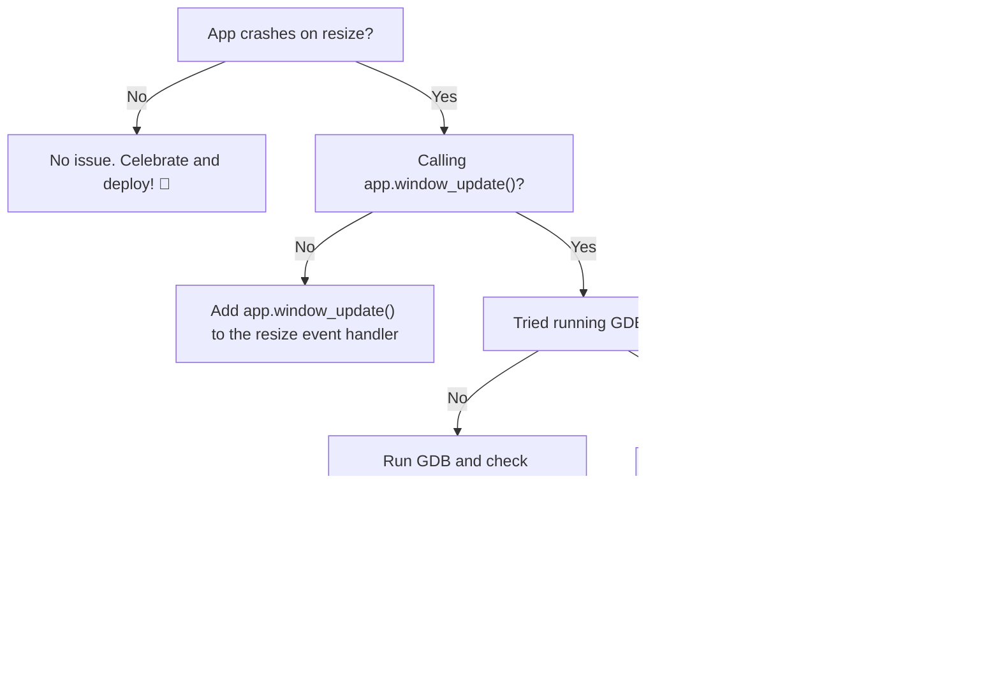

## Glint

### What to do when not working?

```mermaid
graph TD
  A[App crashes on resize?]
  A -->|No| Z[No issue. Celebrate and deploy! 🎉]
  A -->|Yes| B["Calling app.window_update()?"]

  B -->|No| X["Add app.window_update() to the resize event handler"]
  B -->|Yes| C[Tried running GDB?]

  C -->|No| Y[Run GDB and check backtrace]
  C -->|Yes| D[Still broken?]

  D -->|No| W[You fixed it! Go you! 🚀]
  D -->|Yes| E[Contact me with logs & tears]
```